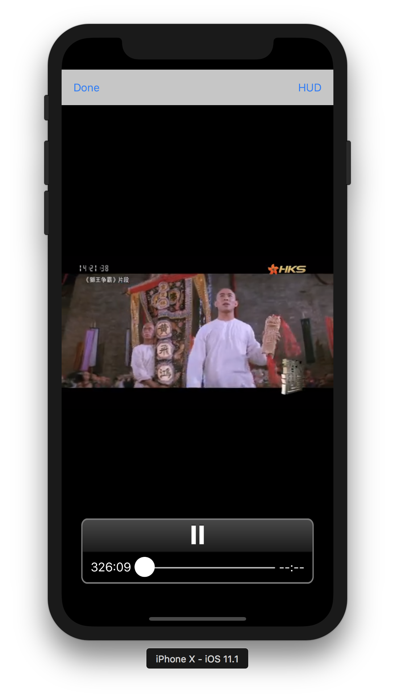

# ijkplayer

[Bilibili/ijkplayer 0.8.3](https://github.com/Bilibili/ijkplayer) cocoapods,iOS video player based on FFmpeg n3.3, with MediaCodec, VideoToolbox support.

# screenshot




# usage

```ruby
pod 'ijkplayer', '~> 1.1.0'
```

OC 参考ijkplayer项目，Swift 参考ijkplayer-Swift项目。

## OC

```ruby
platform :ios, '7.0'
```

## Swift

```ruby
platform :ios, '8.0'
use_frameworks!
```

1. 添加 <Project>-Bridge-Header.h。 -> "#import <IJKMediaFramework/IJKMediaFramework.h>"
1. Build Settings -> Ojbective-C Bridging Header -> "<Project>-Swift/<Project>-Swift-Bridge-Header.h"

# LICENSE

ijkplayer is licensed under [LGPLv2.1 or later](LICENSE), so itself is free for commercial use under LGPLv2.1 or later
